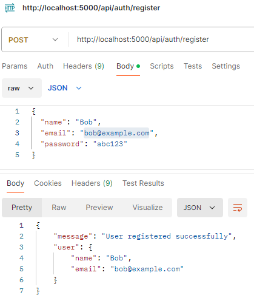
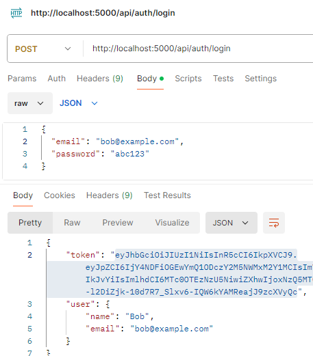
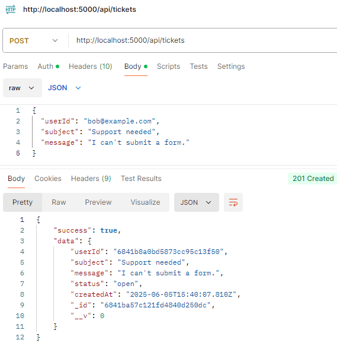

## 📝 Changelog

### [feature/init-app]

**Date:** 2025-06-04  
**Status:** Completed  
**Scope:** Initial Application Scaffolding 

**Issue:** `#1`

#### 🚀 Features Added
- Bootstrapped a Node.js + Express app with:
  - JSON body parsing (`express.json`)
  - Clean project structure inside `/src` directory
- Created route definitions for:
  - `POST /api/forms` – Handles basic form submissions
  - `POST /api/tickets` – Handles ticket creation
- Defined simple in-memory data stores via models:
  - `Forms` model
  - `Tickets` model
- Implemented controllers:
  - `formController.js` – Validates and stores submitted form data
  - `ticketController.js` – Validates and stores ticket data
- Combined routes into a single `routes/index.js` file
- Configured the root server file: `src/app.js`
  - Mounted `/api` namespace for versionless endpoints
  - Default health check route: `/`
- Added basic testing and validation of schema inputs

#### 📁 Directory Overview
- `/routes` → Unified API route declarations
- `/controllers` → Handles request logic
- `/models` → In-memory schema + data storage
- `app.js` → Initializes and mounts Express

#### 🔧 Dev Environment
- Added `nodemon` for development reloads
- Script: `npm run dev`


### [feature/init-middleware]

**Date:** 2025-06-04  
**Status:** Completed
**Scope:** Add foundational middleware for auth and CORS

**Issue:** `#2`

#### 🔐 Authentication Middleware (`auth.js`)
- Introduced JWT-based middleware to validate `Authorization: Bearer <token>` headers
- Middleware parses and verifies JWT using `process.env.JWT_SECRET`
- Injects `req.user` into the request lifecycle for protected routes
- Will serve as the entry point for expanding to OAuth flows (Google, GitHub, Facebook)

#### 🌐 CORS Middleware (`cors.js`)
- Implemented dynamic CORS setup using a whitelist from `process.env.ALLOWED_ORIGINS`
- Supports requests from trusted domains (e.g., `caldwellfence.com`, `linvestus.com`)
- Fallback for non-browser clients (Postman, mobile apps)

#### 🔧 Application Integration
- Registered both middlewares in `app.js`
  - `cors(corsOptions)` for global use
  - `auth` imported selectively in routes (`/api/tickets`)
- Added fallback error messages for invalid or missing tokens
- Environment variable expectations:
  ```env
  JWT_SECRET=your_jwt_secret
  ALLOWED_ORIGINS=https://client1.com,https://client2.com,http://localhost:3000
  ```
#### ✅ Test Coverage
- Verified form submission endpoint remains public
- Verified ticket endpoint is protected and returns 401 without a valid token


### [feature/init-logging]

**Date:** 2025-06-05  
**Status:** Completed  
**Scope:** Integrated structured logging using Pino

**Issue:** `#8`

#### 🛠️ Logger Setup
- Created `src/utils/logger.js` to initialize a Pino instance
- Configured logger to output raw JSON logs (no `pino-pretty`) using:
  - ISO timestamps via `pino.stdTimeFunctions.isoTime`
  - `level: 'info'` as default
- Skipped pretty-print transport to ensure compatibility across environments and avoid build/runtime crashes

#### 📥 Middleware Added
- `requestLogger.js` logs every incoming request:
  - HTTP method
  - Request path
  - Timestamp

#### 🔄 Controllers Updated
Integrated logging into all core controllers:
- **`authController.js`**
  - Logs registration and login attempts
  - Warns on duplicate or failed logins
- **`formController.js`**
  - Logs incoming form submissions and validation errors
- **`ticketController.js`**
  - Logs ticket creation success and error states

#### 🧪 Verified Behavior
- Logs structured entries to console
- Fully functional without `pino-pretty`
- Ready for future integration with log collection pipelines

### [feature/init-db]

**Date:** 2025-06-05  
**Status:** Completed  
**Scope:** MongoDB integration and model migrations

#### 🗄️ Database Setup
- Connected application to a hosted MongoDB Atlas **Flex Cluster** named `Cyntax`
- Created `.env` configuration for `MONGO_URI`
- Removed deprecated Mongoose connection options (`useNewUrlParser`, `useUnifiedTopology`)
- Verified connection via `connectDB()` in `src/config/db.js`

#### 🧬 Mongoose Models Introduced
- `User`: stores registered user accounts
- `Ticket`: stores internal support requests (linked to `User` via `ObjectId`)
- `FormSubmission`: stores client-facing contact form data (source-tagged)

#### 🔁 Controller Migrations (from in-memory → MongoDB)
- `authController` now reads/writes `User` documents with:
  - `User.create()`
  - `User.findOne()`
- `formController` now uses `FormSubmission.create()` for client submissions
- `ticketController` now creates tickets via `Ticket.create()`
  - `userId` is extracted from JWT token (stored as `ObjectId` reference)

#### 🧪 Verified Endpoints
- `/api/auth/register` & `/api/auth/login` → persist + authenticate users
- `/api/forms` → stores form submissions into MongoDB
- `/api/tickets` → stores authenticated tickets linked to users

---

#### 🖼️ Postman Test Proof

Below are successful Postman tests verifying the `/auth/register`, `/auth/login`, and authenticated `/tickets` endpoints:

**1. Register**



**2. Login**



**3. Authenticated Ticket Creation**



---